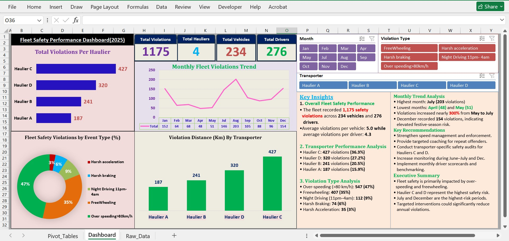

# Fleet Safety Performance Dashboard

## Overview
This project is an interactive Microsoft Excel dashboard designed to monitor fleet safety performance.

## Features
- KPI Cards
- Monthly trends
- Safety Events Violations analysis
- Driver performance
- Vehicle safety metrics
- Interactive slicers
- Data Insights

## Tools Used
- Microsoft Excel
- Pivot Tables
- Pivot Charts
- Slicers
- Conditional Formatting
- Functions and Formulas

## Dashboard Preview

## Author
Paul Wambua Kimanzi
